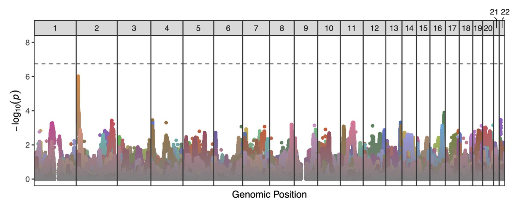

In genome-wide association studies, the threshold for determining the statistical significance of an association for any given genetic site (SNP - single-nucleotide polymorphism) is the "genome-wide significance" cutoff. The p-value for this is usually `p < 5e-8`; this is computed by dividing the standard alpha (p-value) threshold for significance, 0.05, by the number of sites considered in the human genome. 

However, for studies where the genome-wide effect is being investigated in datasets with high linkage disequilibrium (LD), this cutoff may be too stringent. This was the case in our **[test for transmission distortion](https://elifesciences.org/articles/76383)**, in which we investigated the ratio of alleles at each site within a set of sperm ranging from 969 to 3,377 gametes from each of 25 donors. 

Because these haploid gametes were extremely related - i.e., they were sperm produced by different combinations of the two parental haplotypes from a given donor - we determined that each SNP was not its own independent test. Thus the standard cutoff for signifiance (also called the Bonferroni correction) would be too stringent. 

Instead, we needed to determine the effective number of independent tests (Meff) we were conducting, given the strong linkage between sites in our dataset. We did this by using the software **[simpleM](https://simplem.sourceforge.net/)** in R. To implement it, I modified their example script, `simpleM_Ex.R` and used their functions `Meff_PCA()` and `inferCutoff()`. 

I first applied our package, **[rhapsodi](https://github.com/mccoy-lab/rhapsodi)** to the raw data for each donor, one chromosome at a time. I then applied `simpleM` to those imputed gamete genotypes, with each row as a site on the genome and each column as a sperm cell. 

I could then sum the number of effective tests on each chromosome across all donors. SimpleM estimated 281,368 effective tests, compared to 34,799,282 nominal tests. At an alpha of 0.05, we'd calculate a significance threshold of `0.05/281368 = 1.777703221 x 10e-7`. 

<figure class="figure">
	
	<figcaption class="figcaption">The strongest signal of TD occurred at the end of chromosome 2 (transmission rate = 833 of 1571 [56.2%]; p-value = 9.6×10-7) for donor NC18 (depicted in dark yellow).</figcaption>
</figure> 

We then used this cutoff to determine statistically significant transmission distortion (TD) in our **[paper](https://elifesciences.org/articles/76383#s2)**. Spoiler: even with the adjusted p-value, none of the imbalances was significant; see line at `p = 1.78 x 10e-7`. 

Citations: 
- Gao X. Multiple testing corrections for imputed SNPs. Genet Epidemiol. 2011 Apr;35(3):154-8. doi: 10.1002/gepi.20563. 
- Gao X, Becker L, Becker D, Starmer J, Province M. Avoiding the high Bonferroni penalty in genome-wide association studies. Genet Epidemiol. 2010 Jan;34(1):100-105. doi: 10.1002/gepi.20430. 