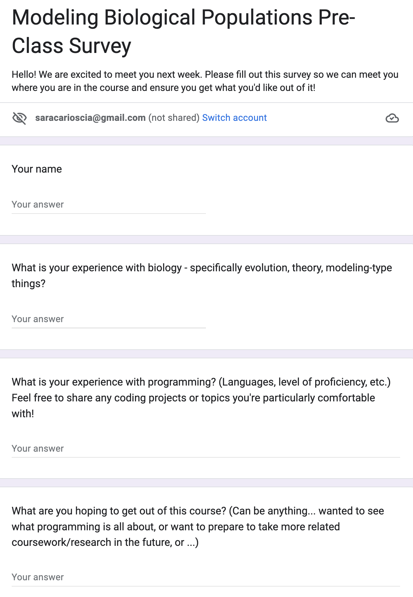
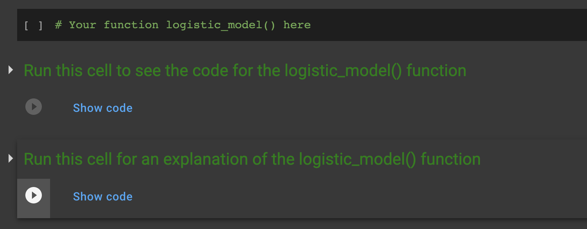

## Thinking through an Intersession course 

I've decided I'm obsessed with Intersession. Spring semester at Johns Hopkins starts the last week of January. So for three weeks between holiday break and late Jan., undergraduates can explore one- or two-credit courses in topics not generally offered during the semester. We met with Dr. Emily Fisher, the Director of the undergraduate biology major, to get a sense of where student interests were and how our course might contribute to departmental offerings. We also met with Allon Brann, a teaching support specialist at JHU, to go over the pillars of course design. After kicking around some ideas in the broad space of computational biology, my friend [Andrew Bortvin](https://andrew-bortvin.github.io/) and I decided to offer a course in modeling biological populations.

## Course design 

"Biological populations" is a vague term - and intentionally so. A population can range from a group of individuals to a group of cells to a group of alleles... and we let our course walk through each of those. 

We chose to offer the course in the Python programming language, because 
- Reasonably good resources exist for collaboration (e.g., Google Colab) and don't require students to download any programs on their computers
- It's commonly used in the field
- The principles can be translated and applied to other scripting languages such as R

As a two-credit course, we were required to offer 24 instructional hours and elected to do so over a two-week period. (I think we could've done this in a three-week period, but we'd both taken more immersive coding classes, like the computational bootcamp and quantitative biology courses for our grad program, and thought a condensed view would help get the students - especially the more novice coders - more comfortable with the material.) We decided on Tues-Wed-Thurs, Tues-Wed-Thurs, for four hours each day (1-5pm).  

We had both been instructors of students with varying levels of experience in coding, and we both care deeply about meeting our students where they are and maximizing their learning. We sent out a pre-class survey to our students to get a sense of their comfort with the concepts (biological modeling and coding in Python). We knew our class had a maximum of 12 students, so we used free-response questions to allow them maximum flexibility in their answers. 

<figure class="figure">
	
	<figcaption class="figcaption">Survey sent to enrolled students a few days ahead of class.</figcaption>
</figure> 

We were pretty lucky that our group split cleanly into two groups with regard to programming experience: 5 students had responses along the lines of "I've taken courses in Python and related languages", and the other 5 clustered around "I get the basic idea of coding: type and computer go vroom." 

There was more variation in their experience with biology (some juniors who had taken most of the courses required for the biology major, and some first-years who took AP Bio), but we decided to leverage that variety and let the students drive the broad biological topics with their own curiosity. 

To borrow Andrew's wording from the Syllabus, we ran the course in two sections (in two separate rooms), "one of which focuses more on coding fundamentals and syntax, and one which moves at a faster pace and covers more biological implementation for students comfortable with programming."

## Course execution 

For course materials, we designed: 
- A completely filled-in "instructor notes" version of the Jupyter Notebook via Google Colab, which we could view during class and used to guide our teaching
- A sparse "student notes" version, for in-class use. This included all the theory and exercises, as well as comments prompting them to code each step (with varying levels of detail as the course continued). We also made use of the "hints" option in Google Colab, which let us offer them explanations, code snippets, and other fun facts that they could access if they wished 
- A completely filled-in version of the student notes, which had the answers to the questions worked on in class, answers to the advanced exericses offered, and additional cells explaining (both in word and in code) any other topics that came up organically during class

<figure class="figure">
	
	<figcaption class="figcaption">An example of a student notebook, where we wrote in a comment prompting them to code the next step and offered hints (which they can view only if they choose) for the code of the model and an explanation behind each step of the model.</figcaption>
</figure> 

Now for implementing the course. It took a few days to arrive at this approach, but we found that the ideal use of those four hours was: 
1. Start with a brief powerpoint introducing a paper that used modelling to address whatever population we were going to discuss as a class 
2. Introduce the model du jour, the math and theory/rationale behind it 
3. As necessary, introduce coding fundamentals required to implement the model 
4. Live-code the basic model 
5. Assign questions for students to do on their own or in small groups 
6. As necessary, offer more "advanced" exercises for students to add complexity to their models and apply them to different situations.

We took breaks throughout, based on student energy and cadence of the class. We also walked around, often sitting next to students. I found that questions like "What are you working on?" got better responses than "How's it going?" or "Can I help?". The students would start by explaining their approach and how they were implementing it in code, and it would organically lead to some question - either practical ("this isn't working") or more theoretical ("I'm not sure how to get from x to y"). 

I also tried to keep each model open-ended, so that students could suggest populations, species, cell types, etc. that interested them, and we would use those as examples in class. One student brought up capybaras, which I had never seen before: 

<iframe src="https://giphy.com/embed/EviMvUKRFnF8Gkz93W" width="480" height="480" frameBorder="0" class="giphy-embed" allowFullScreen></iframe>
<a href="https://giphy.com/gifs/zooberlin-EviMvUKRFnF8Gkz93W">via GIPHY</a>

We also offered a mid-class survey after the first week, to ask students about the pacing and balance of the course, as well as to solicit input on anything they were particularly interested in. This was really helpful, and we used the weekend to make sure our upcoming course plans addressed these topics. 

## A day in the life of an Intersession instructor

Alarm goes off at 5:45am. I hop out of bed, energized and ready to brave public transportation and tackle my day! [Record scratch] I roll over, already strategizing about how to acquire free coffee when I get to campus. 

<iframe src="https://giphy.com/embed/ceeFbVxiZzMBi" width="480" height="360" frameBorder="0" class="giphy-embed" allowFullScreen></iframe>
<a href="https://giphy.com/gifs/people-coffee-very-ceeFbVxiZzMBi">via GIPHY</a>

For the majority of class days, I spent the morning recapping yesterday's experience. This meant filling in the student notes with any additional material that came up in class, writing a summary email to students, and then tailoring the beginning of that day's lecture notes and materials to pick up where yesterday ended (and to personalize the course material based on student interests from the previous day). This took a lot of time, because I wanted to tailor the course to student interests and abilities.  

We offered an office hour before the start of class each day (12-1pm); I actually prefer calling these "student hours" to emphasize that the time is for the student, but literally not one student showed... so they really were office hours. This allowed Andrew and I extra time to prep and check in about where our respective sections were and what we wanted to emphasize that day. However, students (especially in the more syntax-focused group) stayed 45 minutes after class on average (sometimes even up to 90 minutes!) to keep working on their code and pepper us with questions. If I were to do this again, I'd offer my drop-in time at the end of class, so it could function as more of a "student hour" while their questions were fresh on their minds. 

After the students left, Andrew and I would debrief about our respective sections, highlight what the students particularly latched onto and found exciting, and strategize about how to include those in the following day. We also talked about the challenges - one student who was stuck on a particular syntax, a student who wasn't regularly participating - and worked together to think of how to improve our approaches for the next day. 

<blockquote class="twitter-tweet">
Okay, I&#39;m obsessed with Intersession <a href="https://twitter.com/JohnsHopkins?ref_src=twsrc%5Etfw">@JohnsHopkins</a>. A chance for students to explore a new topic, with no grades + no pressure.   In just one week I&#39;ve seen students with no programming experience start to ask GREAT questions and develop their own intuitions. Obsessed.
&mdash; Sara Carioscia (@saracarioscia) <a href="https://twitter.com/saracarioscia/status/1615489275394416642?ref_src=twsrc%5Etfw">January 17, 2023</a></blockquote> 

## Everyone's favorite: assessment

Assessment in an Intersession course is interesting. For starters, the courses are Pass/Fail, and I don't think there is any penalty for dropping a course, even toward the end of its run. (This kind of meant that each day when all my students showed up, I was relieved.) It was really important to both of us that the students met the course learning goal: know enough to pursue more coding classes and projects. We wanted to get them comfortable with the idea of coding, and we wanted to get them familiar with the questions in biological modeling so they could pursue both on their own. 

How to quantify a student's ability to dig deeper? For a few students this was easy - they anticipated the next step (e.g., add another population to their model) and started at least pseudo-coding right away. I emphasized from the first day how 99% (ok, maybe less) of coding is googling. By the end of the first week, I saw every student able to pseudo-code "I want to do x" and then start googling "how to do x in Python." This is such a fundamental skill and I'm relieved that they picked it up. We asked to see their code books (either at the end of class or via email) and checked generally the logic and reasoning behind their code (we didn't focus on execution of syntax). In a semester-long course, I would assess (Pass/Fail or A/B) based on completion and effort rather than syntax, with some percentage of the code that should execute successfully. (We've had training in the topic of Ungrading and I generally feel that grades neither suport nor accurately represent student learning.)

<blockquote class="twitter-tweet">
An update on <a href="https://twitter.com/hashtag/ungrading?src=hash&amp;ref_src=twsrc%5Etfw">#ungrading</a>! Thanks again to @JHU_CER and <a href="https://twitter.com/JHUTeachAcad?ref_src=twsrc%5Etfw">@JHUTeachAcad</a> for supporting these conversations + encouraging us to be *intentional* in our assessments of student work and learning <a href="https://t.co/nhVDjvhRlG">https://t.co/nhVDjvhRlG</a>
&mdash; Sara Carioscia (@saracarioscia) <a href="https://twitter.com/saracarioscia/status/1384986828701413378?ref_src=twsrc%5Etfw">April 21, 2021</a></blockquote> 

## Lessons learned 

- Early on, I was probably too hands-on with the coding; I remember sitting next to one student suggesting that they use a different data structure for the task at hand. After a couple of days I realized that as an instructor of an Intersession course (where the main learning goal was just to get them comfortable with coding and pursuing further courses or projects), I should have offered a suite of data structures, explaining the benefits and uses of each - and if the student still chose to use the one I didn't like, I should've guided them through that approach. Either it would work, so that's fine, or it wouldn't, and they'd see for themselves why an alternative approach might get them where they want to go. 

- Next time I would walk more slowly through the concepts of 1) reading documentation from packages and 2) writing pseudo-code. We hit both of these organically, and by the end of the course I saw students doing this effectively and on their own; but I think we could've gotten these skills sooner had I added some structured exercises meant to force them to do both of these things. 

- More biology! While I was really excited about getting their heads in a computational space, next time I would include more biological examples up front, even for the lessons that are very specifically focused on coding syntax. 

- This experience really helped me calibrate my involvement in student learning. So many times it was tempting to just take their trackpad and change some wonky syntax. Even when I sat on my hands (literally), I wanted to say "Why are you doing that?" or "How did you decide on this?". I got much better responses to open-ended questions like, "talk me through your code" - and if they didn't recognize where the problem was, I would gently suggest, "What is x? Can you print it?". Almost always, suggesting that they print the variables they were using cleared up a lot of confusion. Print() is now my favorite Python function. I would definitely - especially in the syntax-focused group - emphasize that more in the early days: start by printing everything. 

- In the course evaluations, numerous students mentioned that the course was split between less and more experienced coders. They hailed this as a positive, where they felt comfortable going at their own pace and actually learning the fundamentals. Many emphasized that this was a great feature and that students shouldn't be intimidated about the course. I would definitely emphasize this as a positive in the course description (and in emails I sent to faculty and administrators asking them to advertise the course to relevant students). 

- Teaching is HARD. The preparation was the easy part. The emotional energy of standing in a room with college kids - who chose to trust me with their time and learning - took a LOT of energy. I wanted them to get a lot out of it, and I put in the effort to prepare accordingly, but even just being there definitely took it out of me. 

## Course materials 

Check out our **[syllabus](https://andrew-bortvin.github.io/mbp23.github.io/syllabus/)** and find our course materials (lecture notes, coding demonstrations, exercise answer keys) on our **[Github](https://github.com/scarioscia/modeling_biological_populations)**. Please use anything that you think might be helpful! And let us know if you have any questions or suggestions. 

