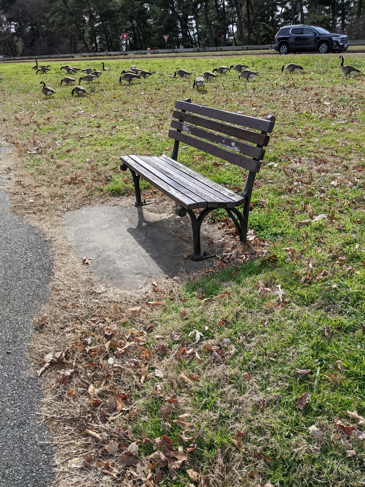
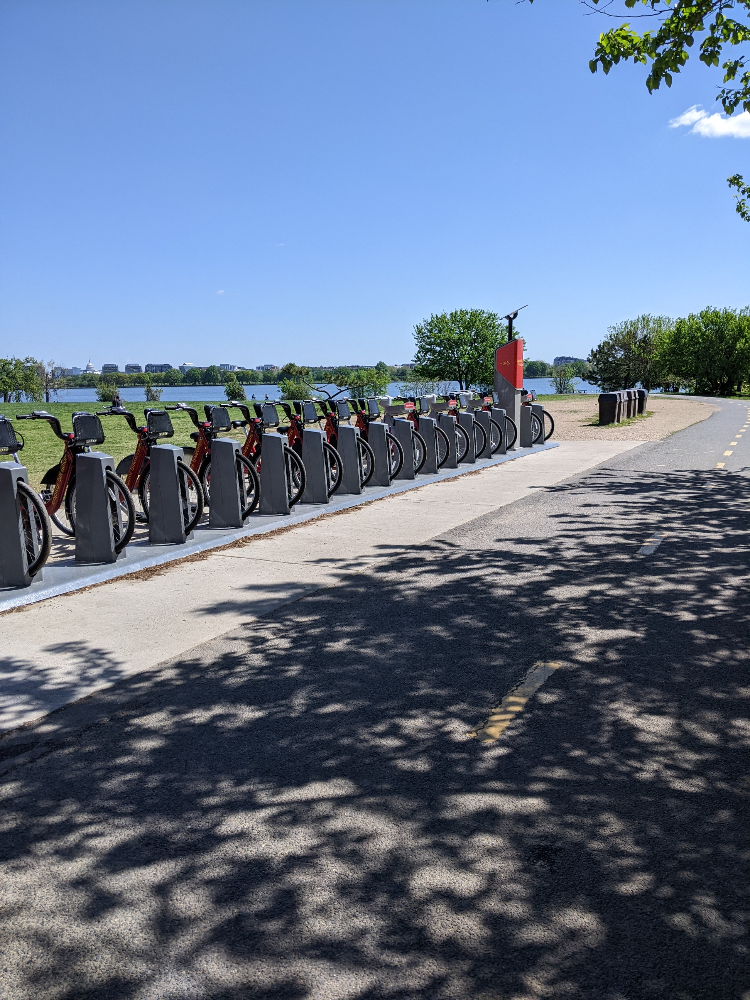
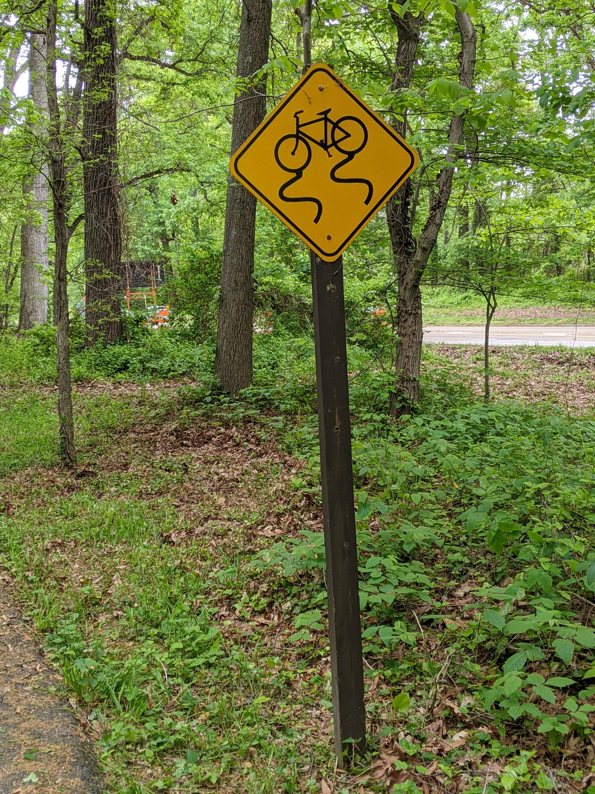
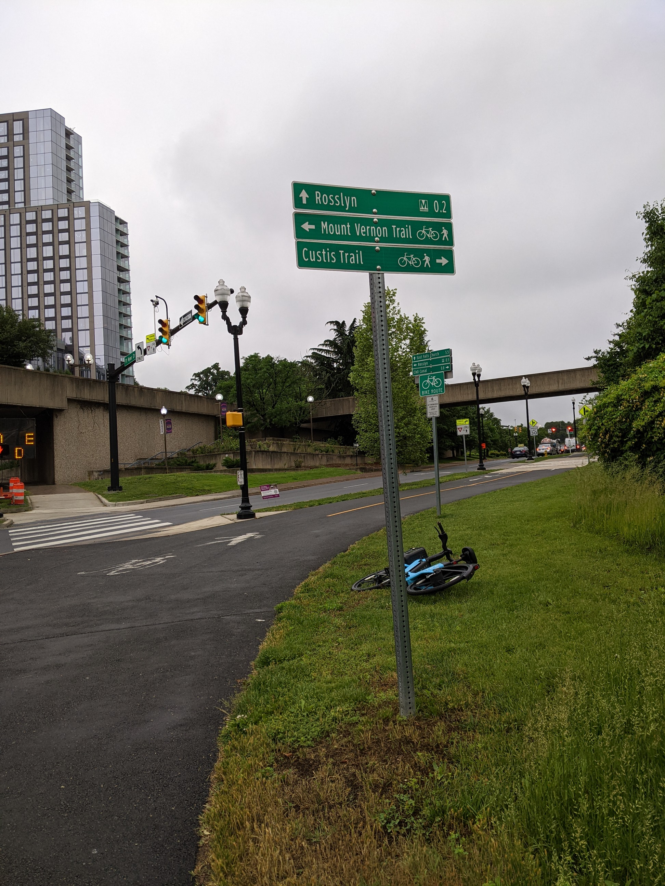

Photos collect metadata on a number of topics, including GPS coordinates. These metadata can be useful for sorting images, mapping them spatially, and tracking progress, among other things.

To extract this photo metadata, I wrote `photoGeoExtractor`, a Python package that builds on existing code online and creates a user-friendly and fast command line process. It offers options to collect all metadata, take only GPS-related information (default), or extract a user-specified set of columns. Check it out on [GitHub](https://github.com/scarioscia/photoGeoExtractor/tree/main) and try the tutorial on your own photos, or on a zip file of sample images in that same directory. 

A bit of backstory... 

The Mount Vernon Trail (MVT) is an 18-mile long paved path through Northern Virginia, starting in the Rosslyn neighborhood of Arlington County and ending at George Washington's home at Mount Vernon. The MVT includes numerous amenities, including water fountains, bike racks, wayfinding signs, and spur connections to other trails and byways. Trail work and improvement (including bridge cleaning, trail widening, invasive species removal) is conducted by the [Friends of the Mount Vernon Trail (FoMVT)](https://mountvernontrail.org/events/), a non-profit partner of the National Park Service. A volunteer with the FoMVT set out to photograph "everything in the ground" along the trail. I wrote this package to extract the GPS coordinates of each photo, so we can place the resources on a detailed map of the trail. I'll share that map here when it's done! 

    
    
    
    

