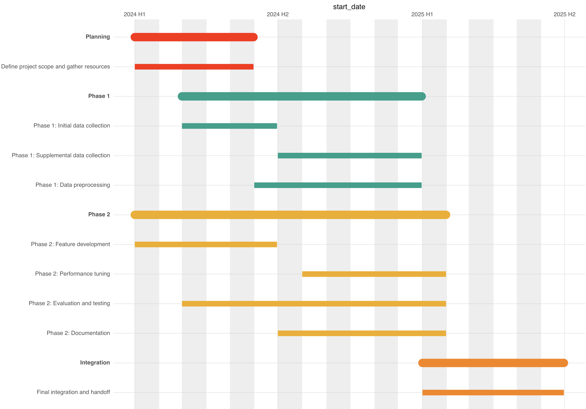

I needed to make a gantt chart for a proposal submission and thought R might be easier than doing it directly in Affinity Designer. The R package `ganttrify` was hugely helpful and offered a detail tutorial in their [README](https://github.com/giocomai/ganttrify). Here's what worked for me. 


The package takes your timeline in four columns: `wp` (the overall categories), `activity`, `start_date`, and `end_date`: 
```
gantt_table <- data.frame(
  wp = c(
    "Planning",
    "Phase 1",
    "Phase 1",
    "Phase 1",
    "Phase 2",
    "Phase 2",
    "Phase 2",
    "Phase 2",
    "Integration"
  ),
  activity = c(
    "Define project scope and gather resources",
    "Phase 1: Initial data collection",
    "Phase 1: Supplemental data collection",
    "Phase 1: Data preprocessing",
    "Phase 2: Feature development",
    "Phase 2: Performance tuning",
    "Phase 2: Evaluation and testing",
    "Phase 2: Documentation",
    "Final integration and handoff"
  ),
  start_date = as.Date(c(
    "2024-01-01",
    "2024-03-01",
    "2024-07-01",
    "2024-06-01",
    "2024-01-01",
    "2024-08-01",
    "2024-03-15",
    "2024-07-15",
    "2025-01-15"
  )),
  end_date = as.Date(c(
    "2024-05-31",
    "2024-06-30",
    "2024-12-31",
    "2024-12-31",
    "2024-06-30",
    "2025-01-15",
    "2025-01-15",
    "2025-01-15",
    "2025-06-30"
  ))
)
```

You then create a `ganttrify object`, which offers some options for customization - but further details can be adjusted in plotting. You can also turn off month numbers or month names here. For a cleaner view, you can change `hide_wp` to `TRUE`, which will remove the theme-level headers.
```
library(ganttrify)

p <- ganttrify(
  project = gantt_table,
  by_date = TRUE,
  hide_wp = FALSE,
  project_start_date = min(gantt_table$start_date),
  month_number_label = FALSE,  # turn off default month numbers
  month_date_label = FALSE     # turn off month names
)
```

We can then use `ggplot` syntax to add a layer to customize the axis scales. I also import `lubridate` which rounds the dates to the nearest month or year as requested in order to tidy up visualization. The default view is for each month, which might also be suitable. 
```
library(ggplot2)
library(lubridate)

p + scale_x_date(
  breaks = seq(
    from = as.Date(floor_date(min(gantt_table$start_date), "year")),
    to   = as.Date(ceiling_date(max(gantt_table$end_date), "year")),
    by   = "6 months"
  ),
  labels = function(x) {
    yr = format(x, "%Y")
    mo = as.integer(format(x, "%m"))
    half = ifelse(mo <= 6, "H1", "H2")
    paste(yr, half)
  },
  position = "top"
)
```

<figure class="figure">
  
  <figcaption class="figcaption">The gantt chart, using mostly default settings.</figcaption>
</figure><br>

In this case I added arrows from each intermediate product to its next step (e.g., data generation 1 to data analysis 1) in Affinity Designer, but maybe with some effort it could be overlaid in `ggplot2` directly. A challenge maybe for another time! 
