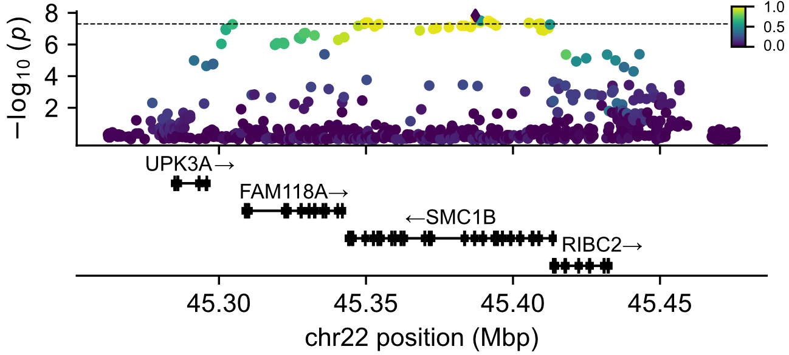
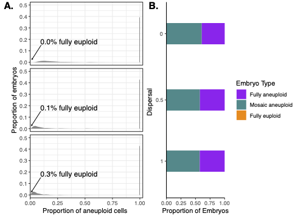

    

        
        
Genetic associations with meiotic aneuploidy in day-5 embryos

        
Aneuploidy is the largest contributor to pregnancy loss. Here I identify genetic associations with aneuploidy incidence across a sample of day-5 IVF embryos.

    

    

        
        
Estimating rates of meiotic and mitotic error in human development

        
Using published clinical data from PGT-A, we identify possible ranges of meiotic and mitotic error rates that best explain ratios of euploid, mosaic, and aneuploid embryos.

    

    

        
        
R package for imputing sparsely-sequenced haploid gametes

        
 Using very low-coverage single-cell DNA sequencing data of gametes originating from a single diploid donor, rhapsodi (1) phases the diploid donor haplotypes, (2) imputes missing gamete genotypes, and (3) discovers gamete-specific meiotic recombination events. I applied this method to >40,000 of single-cell sperm DNA from 25 donors to investigate signatures of transmission distortion.

    

    <!-- 

        
        
Transmission distortion in human sperm

        
Biased transmission of alleles among gametes has been identified in many species. I searched for such bias in a large sample (>40,000) of single-cell sperm DNA from 25 donors.

    

    

        
        
R package for imputing sparsely-sequenced haploid gametes

        
 Using very low-coverage single-cell DNA sequencing data of gametes originating from a single diploid donor, rhapsodi (1) phases the diploid donor haplotypes, (2) imputes missing gamete genotypes, and (3) discovers gamete-specific meiotic recombination events.

    

    

        
        
Exploring science policy at the intersection of research and government

        
Prior to graduate school, I worked as a Science Policy Fellow, engaging in projects including evaluating NASA's Mars mission roadmap, assessing supersonic commercial aircraft feasibility, and reviewing laws governing space technology exports.

    
 -->

